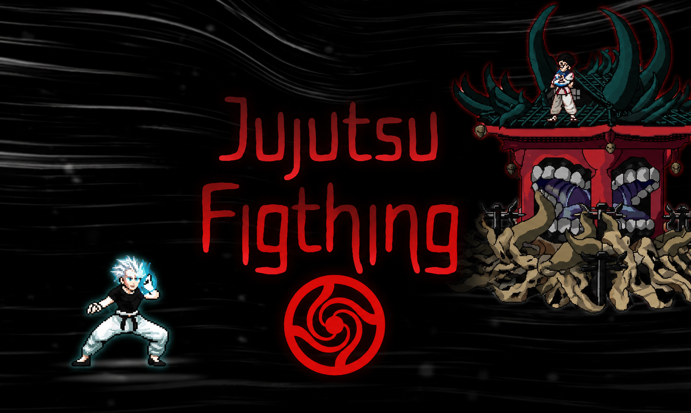
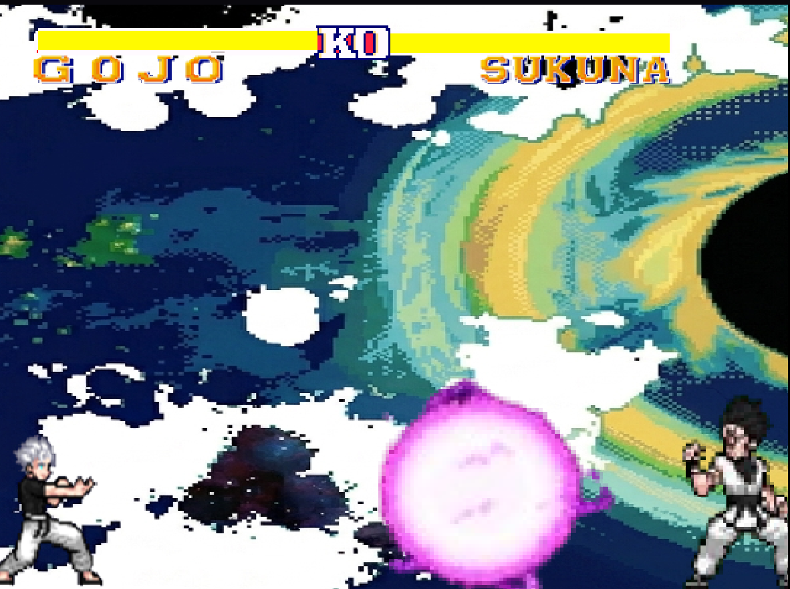

# ⚔️ Jujutsu Fighting

Fan game acadêmico desenvolvido no **Construct 3**, inspirado no arco da **Batalha dos Mais Fortes** de *Jujutsu Kaisen*.

O projeto recria o confronto entre **Gojo e Sukuna** em uma experiência de luta 2D, utilizando mecânicas, habilidades e elementos visuais inspirados na obra.

## 🎮 Gameplay

## 🎮 Sobre o jogo

Jujutsu Fighting foi desenvolvido durante o primeiro bimestre do curso de **Análise e Desenvolvimento de Sistemas**, como um dos primeiros projetos acadêmicos do curso.

A proposta foi aplicar conceitos iniciais de lógica e desenvolvimento de jogos por meio da criação de uma experiência interativa utilizando o Construct 3.

## ✨ Características

- Combate 2D
- Personagens inspirados em Jujutsu Kaisen
- Habilidades especiais
- Mecânicas desenvolvidas utilizando o sistema de eventos do Construct 3
- Cenários e elementos visuais inspirados na obra
- Interface criada especificamente para o projeto

## 🛠️ Ferramentas utilizadas

- Construct 3
- HTML
- CSS

## 📁 Arquivo do projeto

O arquivo `.c3p` disponível neste repositório pode ser aberto utilizando o **Construct 3**.

## 🎓 Contexto

Projeto desenvolvido como atividade acadêmica do **1º bimestre** do curso de Análise e Desenvolvimento de Sistemas.

Este é um projeto de fã criado exclusivamente para fins acadêmicos e de aprendizado, sem vínculo oficial com Jujutsu Kaisen ou seus detentores de direitos.

## 📌 Créditos

Jujutsu Kaisen e seus personagens pertencem aos seus respectivos detentores de direitos.

Sprites e demais recursos de terceiros utilizados no projeto pertencem aos seus respectivos criadores.
